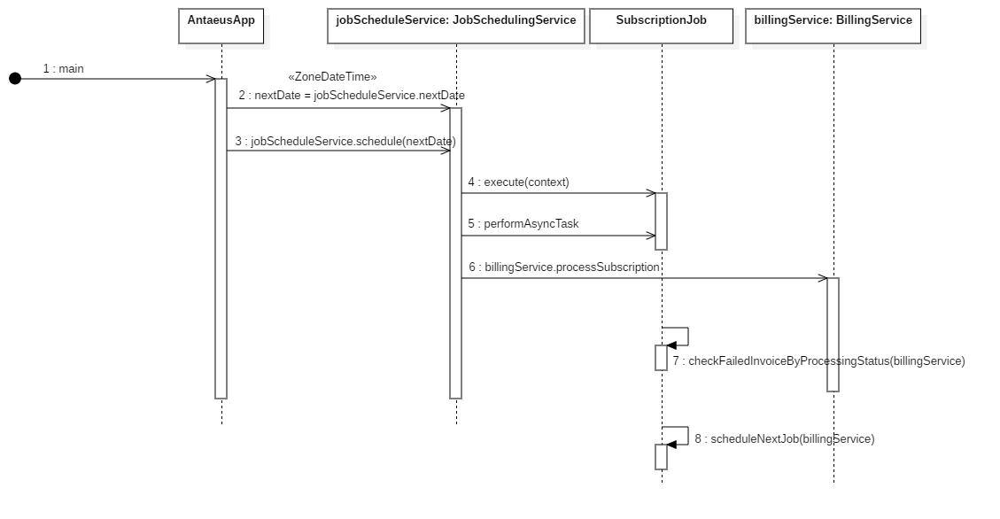

## Antaeus

Antaeus (/ænˈtiːəs/), in Greek mythology, a giant of Libya, the son of the sea god Poseidon and the Earth goddess Gaia. He compelled all strangers who were passing through the country to wrestle with him. Whenever Antaeus touched the Earth (his mother), his strength was renewed, so that even if thrown to the ground, he was invincible. Heracles, in combat with him, discovered the source of his strength and, lifting him up from Earth, crushed him to death.

Welcome to our challenge.

## The challenge

As most "Software as a Service" (SaaS) companies, Pleo needs to charge a subscription fee every month. Our database contains a few invoices for the different markets in which we operate. Your task is to build the logic that will schedule payment of those invoices on the first of the month. While this may seem simple, there is space for some decisions to be taken and you will be expected to justify them.

## Instructions

Fork this repo with your solution. Ideally, we'd like to see your progression through commits, and don't forget to update the README.md to explain your thought process.

Please let us know how long the challenge takes you. We're not looking for how speedy or lengthy you are. It's just really to give us a clearer idea of what you've produced in the time you decided to take. Feel free to go as big or as small as you want.

## Developing

Requirements:
- \>= Java 11 environment

## Solution
The idea for this api is to build a schedule service which charge subscription every first date of every month. It starts in the `AntaeusApp.kt`.
It invokes the `JobSchedulingService(billingService).schedule(nextDate)` in the `JobSchedulingService` class which triggers a
job to run for the next date. When the job is fired `JobSchedule` in `pleo-antaeus-schedule` module.
In the `billingService.processSubscription()`, I have added `processingStatus` field to `Invoice` which will be evaluating and updating invoice status.

`CustomerNotFoundException:`, I'm handling the exception and updating  `processingStatus` to `ProcessingStatus.NOT_FOUND` and updating the invoice table.
In future,we can store logs of these exceptions for decision making.
`NetworkException:` I'm handling the exception and updating `processingStatus` to `ProcessingStatus.FAILED` and updating the invoice table.I'm storing failed invoices
in a local instance variable `failedInvoiceList`. The `checkFailedInvoiceByProcessingStatus()` makes use of the `failedInvoiceList` to crosscheck invoices which failed in the `failedInvoiceList`
and process it again by invoking the `retryInvoiceSubscriptionOperation()`. If there's still `NetworkException` we can send a log report to the admin.

In the `JobSchedule`, when `performAsyncTask()` is completed, it invokes the `scheduleNextJob()`  for the next month. The `performAsyncTask()` has a default maximum retries of 5 which retries the `performAsyncTask`
when `futureTask.isCancelled()` is invoked in the `FutureTask`.

## Sequence Diagram


## Starting up a custom service

I have added an endpoint which starts a new subscription manually

GET: ` /rest/v1/schedule?date={2019-10-26}&time={19:42:00}`


## Running
Running through docker.

Install docker compose on your computer.

```
docker-compose up --build -d
```

### App Structure
The code given is structured as follows. Feel free however to modify the structure to fit your needs.
```
├── pleo-antaeus-app
|       main() & initialization
|
├── pleo-antaeus-core
|       This is probably where you will introduce most of your new code.
|       Pay attention to the PaymentProvider and BillingService class.
|
├── pleo-antaeus-data
|       Module interfacing with the database. Contains the database models, mappings and access layer.
|
├── pleo-antaeus-models
|       Definition of the "rest api" models used throughout the application.
|
├── pleo-antaeus-schedule
|       Module for scheduling jobs. This is where jobs are executed with the support of Quartz Job Scheduler
|
├── pleo-antaeus-rest
|        Entry point for REST API. This is where the routes are defined.
└──
```

### Main Libraries and dependencies
* [Exposed](https://github.com/JetBrains/Exposed) - DSL for type-safe SQL
* [Javalin](https://javalin.io/) - Simple web framework (for REST)
* [kotlin-logging](https://github.com/MicroUtils/kotlin-logging) - Simple logging framework for Kotlin
* [JUnit 5](https://junit.org/junit5/) - Testing framework
* [Mockk](https://mockk.io/) - Mocking library
* [Sqlite3](https://sqlite.org/index.html) - Database storage engine

Happy hacking 😁!
